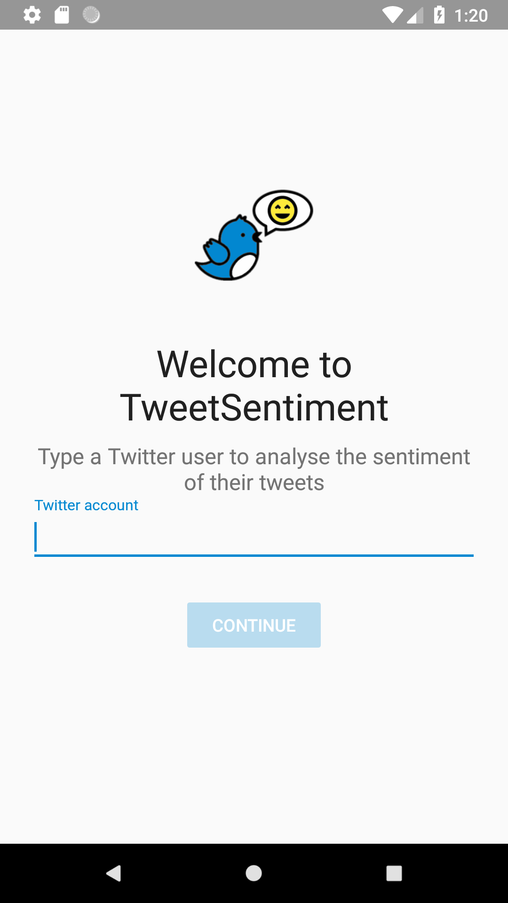
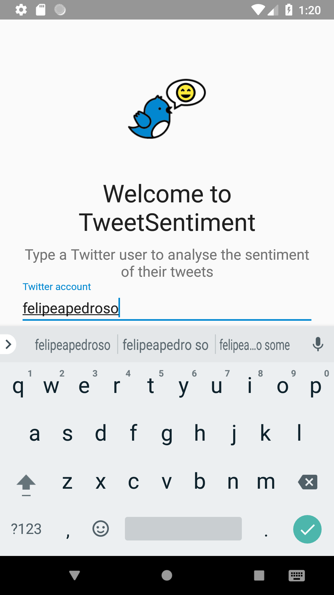
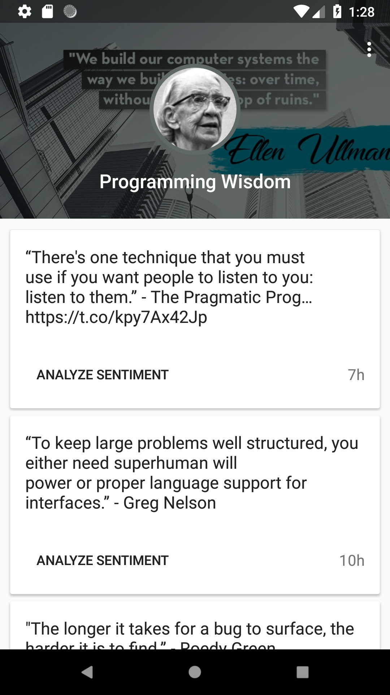
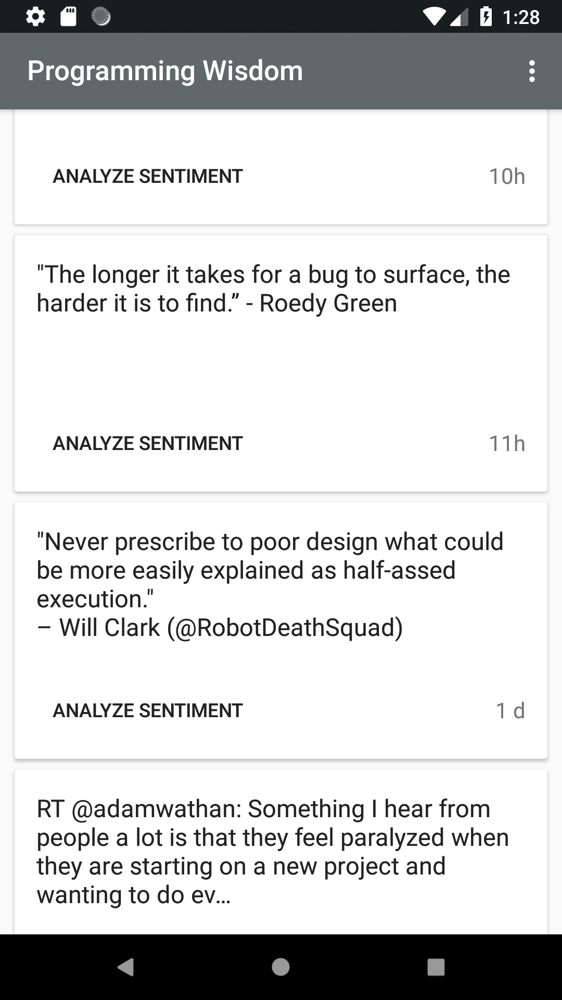
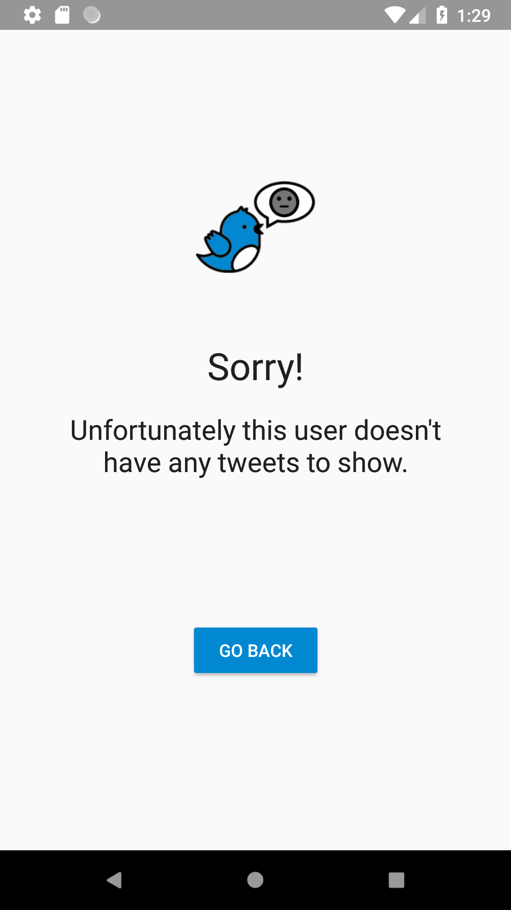

# Tweet Sentiment

## Motivation
This is a small toy app to demonstrate modern approaches to develop Android applications and to learn new techniques.

The goal is to grab the timeline of a Twitter user and allow to analyse the sentiment of each tweet.

You can try the debug application [here](https://drive.google.com/file/d/1buphfrdFysZwiuerWQ-bBgbtIW2TNv_v/view?usp=sharing).

## Screenshots

<p align="center">
  
  
  
  
  
  
</p>

## Characteristics
* 100% developed using Kotlin
* Offline-first application, where the UI consider a database as a Single Source of Truth and the syncronization is made by a background service. The UI is subscribed to the DB and updates everytime a new data is available.
* Reactive architecture using a "passive view" concept. 
* Dependency Injection using Kodein
* The project aims to create a concise and easy to understand code, always trying to be aligned with Clean principles.

## Architecture
This project uses a reactive variation of the MVP architecture, where all the information and interactions are handled by RxJava flows. The basic interaction is:

Views(Activities)   <->   Presenters   ->   Usecases   ->   Model (Data, Network)

To handle the usecases dataflow and coordinate different behaviors, the presenter relies in objects called 'BehaviorCoordinators'. They are RxJava transformers that create a stream composition to organize the dataflow, provide proper UI feedbacks and error handling.

The background sync service also has a "presenter" that is responsible for the coordination of background sync usecases.

All major components are represented by interfaces, allowing an easy implementation replacement and making tests easier.

## Modularization
The project was splitted in the following modules:

* app: responsible for handling the interaction with the Android framework stuff.
* device: handle things like storage, job scheduling and in the future, notifications
* domain: dictates the language spoken by all modules, like the entities, errors, interfaces, etc
* network: conects the app with cloud APIs like Twitter and Google Natural Language Api
* presentation: manages all the flows from the app and establish how the views and services should behave.

The goal of this modularization is to isolate the modules that use the Android Context class (app and device) and, as consequence, allow the code reuse in projects for other platforms (e.g. TornadoFx, Kotlin Native, etc)

## Libraries used
* RxJava/RxAndroid
* Retrofit
* Kodein
* Firebase Job Dispatcher
* Room (Architecture Components)
* Timber
* CircleImageView
* Picasso
* Hawk (properties)
* Support Library

## Know issues
* Some Twitter users doesn't have a banner photo, which leads the app to use a random photo from https://picsum.photos/, which sometimes fail to serve good photos and break the pallete selection.
* The database layer is using a reactive approach to insert and update items, but it's not fully connected to the sync flow.
* Due the time constraint the application doesn't have a test coverage
* The project relies on the Coordinator Layout to create the tweets list feature, which caused a lot of UI problems.

## Future features
* Notifications when the application is closed
* Tests using mockito, expresso and roboeletric

## Original requirements
````
# ifood-mobile-test
Create an app that given an Twitter username it will list user's tweets. When I tap one of the tweets the app will visualy indicate if it's a happy, neutral or sad tweet.

## Business rules
* Happy Tweet: We want a vibrant yellow color on screen with a 😃 emoji
* Neutral Tweet: We want a grey colour on screen with a 😐 emoji
* Sad Tweet: We want a blue color on screen with a 😔 emoji
* For the first release we will only support english language

### Hints
* You may use Twitter's oficial API (https://developer.twitter.com) to fetch user's tweets 
* Google's Natural Language API (https://cloud.google.com/natural-language/) may help you with sentimental analysis.

## Non functional requirements
* As this app will be a worldwide success, it must be prepared to be fault tolerant, responsive and resilient.
* Use whatever language, tools and frameworks you feel comfortable to.
* Briefly elaborate on your solution, architecture details, choice of patterns and frameworks.
* Fork this repository and submit your code.
````
## License

```
The MIT License (MIT)

Copyright (c) 2018 Felipe Pedroso

Permission is hereby granted, free of charge, to any person obtaining a copy of
this software and associated documentation files (the "Software"), to deal in
the Software without restriction, including without limitation the rights to
use, copy, modify, merge, publish, distribute, sublicense, and/or sell copies of
the Software, and to permit persons to whom the Software is furnished to do so,
subject to the following conditions:

The above copyright notice and this permission notice shall be included in all
copies or substantial portions of the Software.

THE SOFTWARE IS PROVIDED "AS IS", WITHOUT WARRANTY OF ANY KIND, EXPRESS OR
IMPLIED, INCLUDING BUT NOT LIMITED TO THE WARRANTIES OF MERCHANTABILITY, FITNESS
FOR A PARTICULAR PURPOSE AND NONINFRINGEMENT. IN NO EVENT SHALL THE AUTHORS OR
COPYRIGHT HOLDERS BE LIABLE FOR ANY CLAIM, DAMAGES OR OTHER LIABILITY, WHETHER
IN AN ACTION OF CONTRACT, TORT OR OTHERWISE, ARISING FROM, OUT OF OR IN
CONNECTION WITH THE SOFTWARE OR THE USE OR OTHER DEALINGS IN THE SOFTWARE.
```